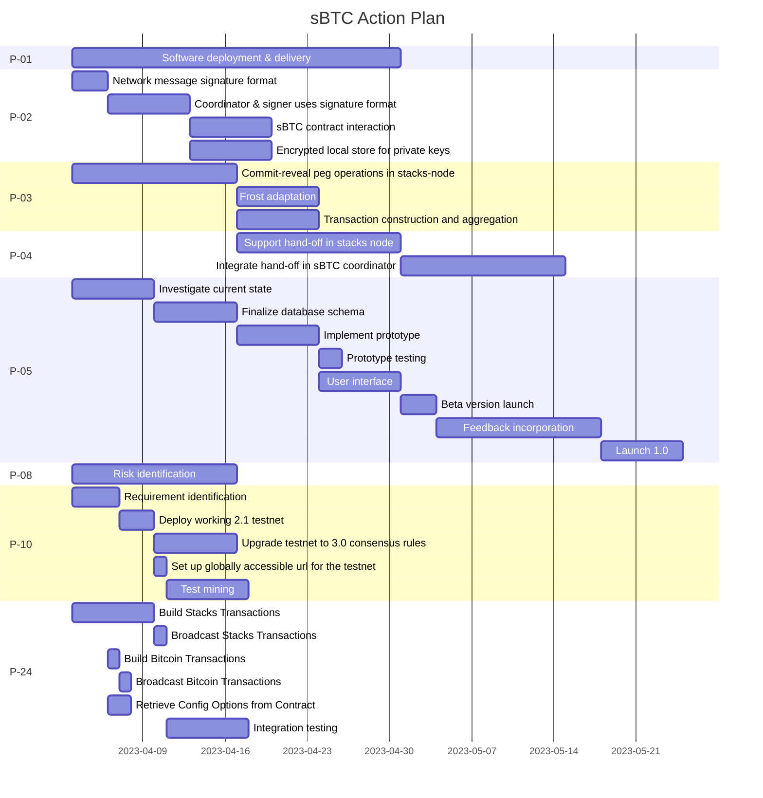

# sBTC action plan
This document aims to gather a high-level view of the projects we're working on to deliver sBTC
on a best-effort basis.

# Projects in motion

## P-01 Software deployment & delivery
Owner: Sergey Shandar

DoD: We have clear and easy-to-use infrastructure that allows anyone to easily participate in sBTC as a signer.

Project Issue: [CoreEng228](https://github.com/Trust-Machines/core-eng/issues/228)

## P-02 Sign and validate FROST shares
Owner: Joey Yandle

DoD: Our FROST implementation only accepts signed messages.

Project Issue: [CoreEng229](https://github.com/Trust-Machines/core-eng/issues/229)

## P-03 Commit-reveal peg operations
Owner: Mårten Blankfors

DoD: sBTC burnchain operations support a format usable from custodian wallets.

Project Issue: [CoreEng230](https://github.com/Trust-Machines/core-eng/issues/230)

## P-04 Peg-handoff system
Owner: Mårten Blankfors

DoD: We have a secure mechanism to hand over custody of the sBTC peg wallet.

Project Issue: [CoreEng231](https://github.com/Trust-Machines/core-eng/issues/231)

## P-05 Stacker DB
Owner: Stjepan Golemac

DoD: Stacks nodes support hosting auxiliary smart contract data which can be used to support stacker communication in sBTC.

Project Issue: [CoreEng232](https://github.com/Trust-Machines/core-eng/issues/232)

## P-08 Risk identification for mini sBTC
Owner: José Orlicki

DoD: Risks revolving mini sBTC have been identified and addressed.

Project Issue: [CoreEng233](https://github.com/Trust-Machines/core-eng/issues/233)

## P-10 Testnet network
Owner: Sayak Chatterjee

DoD: There is a private testnet network that runs the Nakamoto consensus and is equipped with testnet sBTC mechanisms.

Project Issue: [CoreEng234](https://github.com/Trust-Machines/core-eng/issues/234)

## P-24 Alpha coordinator
Owner: Jacinta Ferrant

DoD: Stacks signers can coordinate to fulfill their responsibilities as needed for sBTC alpha.

Project Issue: [CoreEng235](https://github.com/Trust-Machines/core-eng/issues/235)
