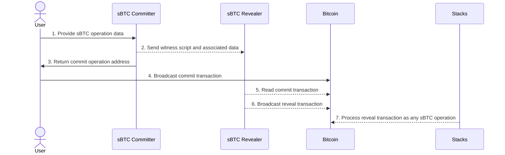

# Commit reveal operations for sBTC
This document introduces a new method of interacting with sBTC.
This method includes two things.

1. A new operation format for Stacks nodes to observe on Bitcoin.
2. A protocol leveraging this format to submit sBTC operations.

This work builds on previous material and discussions.
Follow the links in the background section to learn more about prior work on the topic.

## Background
The main interaction with sBTC from users is through bitcoin transactions. These
transactions must conform to a specific format to be able to interact with the
sBTC system.

The original sBTC design from [SIP-021](https://github.com/stacksgov/sips/blob/56b73eada5ef1b72376f4a230949297b3edcc562/sips/sip-021/sip-021-trustless-two-way-peg-for-bitcoin.md)
introduces an operation format using `OP_RETURN` data. Let's call this the SIP-021 format in this document.
The SIP-021 format require users to be able to construct transactions with multiple outputs,
embedding data on bitcoin using an `OP_RETURN` output. However, such transactions cannot be created
from many wallets, and custodian services.

Due to this observation, [FriendsFerdinand](https://github.com/FriendsFerdinand) created an alternate
[proposal](https://docs.google.com/document/d/1EnYEk6gA2w6VfRpT8CcK8mghZRMUEjn2OhHwzdK_9x0) examplifying
how to embed data on-chain using P2SH redeem scripts, and the `OP_DROP` operation.
Based on this porposal, [Jude](https://github.com/jcnelson) described an alternate peg-in flow in
his [mini sBTC design](https://docs.google.com/document/d/1EnYEk6gA2w6VfRpT8CcK8mghZRMUEjn2OhHwzdK_9x0).

This document consolidates the information in the `OP_DROP` proposal and mini sBTC design into a
single coherent design.

## Design goal
The goal of this design is to extend the sBTC design to allow customers of custodian wallets to use sBTC.

## The commit-reveal operation format
In contrast to SIP-021 operations, where an operation is submitted to the blockchain in a
single transaction, a commit-reveal operation is submitted to the chain using two transactions.
These transactions are as the name suggests a _commit_ transaction and a _reveal_ transaction.

The _commit_ transaction only has one requirement. It must contain an output to either a p2tr or a p2sh address.
This address should use a witness script of the following form:

```
<DATA> OP_DROP <LOCK SCRIPT...>
```

The first byte of the witness data must be a valid sBTC opcode as defined in [SIP-021](https://github.com/stacksgov/sips/blob/56b73eada5ef1b72376f4a230949297b3edcc562/sips/sip-021/sip-021-trustless-two-way-peg-for-bitcoin.md).
The remaining data must not take more than 77 bytes of block space.

The data format is the same as the corresponding `OP_RETURN` data format for the
specific sBTC op minus the first two magic bytes, which must still be present
in an `OP_RETURN` output of the reveal transaction. In addition to this, the data
must also specify the maximum fee the Revealer is allowed to spend on the reveal
transaction.

```
0  1                            78             86
|--|----------------------------|--------------|
 op             data               reveal fee
```

The _reveal_ transaction must consume a UTXO from a _commit_ transaction as its first input.
In addition, the first output of the _reveal_ transaction must be an `OP_RETURN` output with
the following three-byte payload:

```
0      2  3
|------|--|
 magic  op
```

where the opcode is `w`, the `magic` bytes are `T2` for mainnet and `X2` for testnet.

By consuming a UTXO from the _commit_ transaction, the _reveal_ ransaction will disclose
the data embedded in the witness script. This is the data which would have been part
of the `OP_RETURN` output in a SIP-021 operation. Anyone observing a bitcoin op with
opcode `w` would know to look for the data in the witness of the first input, instead
of in the rest of the `OP_RETURN`.

Any remaining outputs of the _reveal_ transaction must be of the same form as in the SIP-021 format.
For example, the _reveal_ transaction of a peg out request
must contain two additional outputs. The first output should provide the BTC recipient address
and the second output should fund the fulfillment transaction.

## Commit-reveal protocol
To submit a commit reveal operation, three systems must interact:

1. _Committer_
2. _Revealer_
3. Bitcoin

The _Committer_ is typically a web application, and acts as the user interface for the commit reveal flow.
In sBTC mini, this will be a part of the [sBTC Brdige](https://github.com/Trust-Machines/sbtc-bridge-web).

The _Revealer_ is a system maintaining a bitcoin wallet, capable of creating and broadcasting _reveal_ transactions.
It exposes an API for the _Committer_ to provide witness data and any additional data required to construct
a proper _reveal_ transaction for each specific op. For sBTC this may be integrated in the sBTC coordinator,
or deployed as a standalone application.

**1. The user provides operation data to the sBTC _Committer_.**
To start the process, the user must interact with a sBTC _Committer_ to construct the commit transaction.
The committer prompts the user for any data the system needs to complete the operation.

**2. The _Committer_ sends the witness script and associated data to the _Revealer_.**
Once the UI has enough information to complete the operation, it constructs a witness script spendable
by the _Revealer_. This script, alongside any other information required by the _Revealer_ is then sent
to the _Revealer_.

**3. The _Committer_ returns the commit operation address to the User.**
After the _Revealer_ has received the witness script and associated data, the system is ready for the commit
transaction. The _Committer_ returns the commit operation address to the User, along with the witness
script if the User wishes to verify the correctness of the address.

**4. The User broadcasts the commit transaction.**
The User makes a payment to the commit address through their wallet, which results in the commit transaction
being broadcasted to Bitcoin.

**5. The _Revealer_ reads the commit transaction.**
Having already received the witness script, and hence the address of the commit transaction, the revealer
notices and reads the commit transaction.

**6. The _Revealer_ broadcasts the _reveal_ transaction.**
The _Revealer_ now has all the information it needs to construct, sign and broadcast the _reveal_ transaction.
However, the _Revealer_ is not required to do so. It may choose to ignore the commit transaction altogether,
if it finds the cost of revealing the transaction to be too high. Therefore, the commit transaction
output should amount to at least the output amount of the _reveal_ transaction plus the transaction fee for the miner.

Security note: The _Revealer_ has the possibility to steal the commit transaction for it's own use. Doing
this is a visible crime on the chain, but it relies on the _Revealer_ to be a trusted entity. If the _Revealer_
is operated by Stackers, it is possible to implement mechanisms to penalize such behavior.

**7. Stacks and sBTC read the _reveal_ transaction as any sBTC op.**
Once the _reveal_ transaction is published, it contains the same information as a traditional `OP_RETURN` transaction
and can be processed in the same way by the stacks node.

### Summary
This chart summarizes the entire commit reveal operation flow



## Implementation considerations

### Initial support only for peg in and peg out request operations
Although this protocol is general and can be implemented for any bitcoin operations on Stacks, it is only evident
that it will provide value for the user-initiated sBTC operations, i.e. peg in and peg out request operations.
Therefore, we aim to focus the sBTC implementation of this protocol to only support these operations.

### Reclaimable commit transactions
There is no guarantee that a commit transaction will be processed by a _Revealer_. Therefore, we strongly engourage
the Committer to include a mechanism for a user to reclaim their funds if they are not processed. This can be
achieved in many different ways, each with their own advantages and limitations. It is up to the Committer implementation
to design and implement this mechanism. The commit-reveal protocol is agnostic to wether or not the commit transaction
is reclaimable.

### _Revealer_ API
The API of the _Revealer_ is unspecified, meaning that the _Revealer_ and Committer must be implemented in tandem.
Once the system matures, we might reconsider standardizing the API.

### If the changes to Stacks node are unfeasible
Although the _Revealer_ and Committer can be implemented before any changes are made in the Stacks node, the whole flow
is pointless if the Stacks blockchain is unable to process _reveal_ transactions. One possible workaround in the scenario
that we are unable to change this in the Stacks implementation, is that the _reveal_ transaction may be made entirely
compatible with SIP-021 and contain the whole `OP_RETURN` data. This would waste precious block space on Bitcoin though.

## Implementation milestones
### 1. Stacks modified to understand _reveal_ transactions
The first milestone in this project is to modify the stacks blockchain to be able to parse data from witness scripts
using the OP_DROP format.

### 2. Reference _Revealer_ implemented
Once the Stacks blockchain understands the reveal transactions, we must implement a _Revealer_ which may be deployed
standalone or integrated in the stacks coordinator. The revealer must be able to:

1. Receive witness scripts and associated data from the Committer
2. Observe commit transactions on Bitcoin
3. Submit reveal transactions to Bitcoin

### 3. Reference Committer implemented
The reference _Revealer_ should be accompanied by a reference Committer which shows how to interact with the _Revealer_.
This could be a CLI, or a web application. The Committer must be able to:

1. Transform user input to a witness.
2. Send the witness data and necessary info to the _Revealer_ API.
3. Return an address to the user to construct the commit transaction.

### 4. End-to-end integration tests
Ensure the flow works from the commit transaction, all the way to the Stacks node registering the sBTC operation.

### 5. sBTC mini integration
Once the system works end to end, we should integrate it in sBTC mini.

1. Ensure sBTC mini has a _Revealer_ running (possibly integrated in the Coordinator).
2. Ensure sBTC bridge can operate as a Committer against this revealer.
