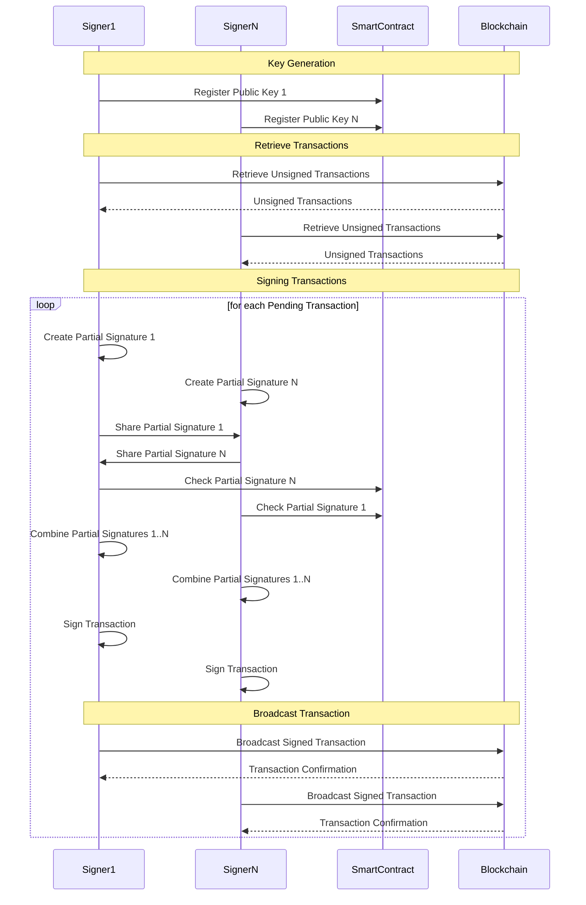
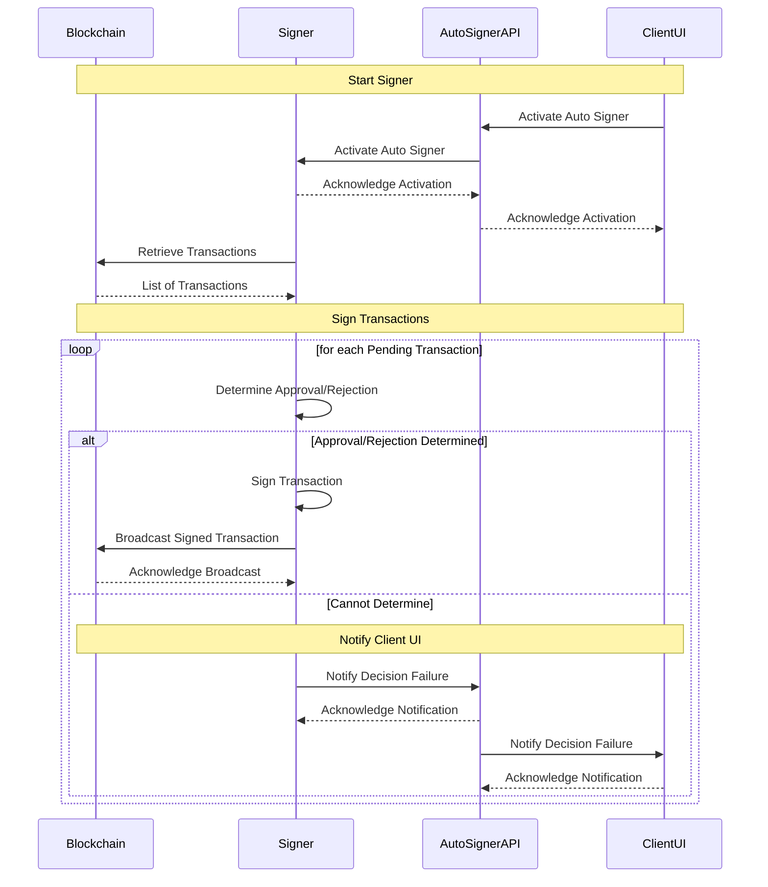
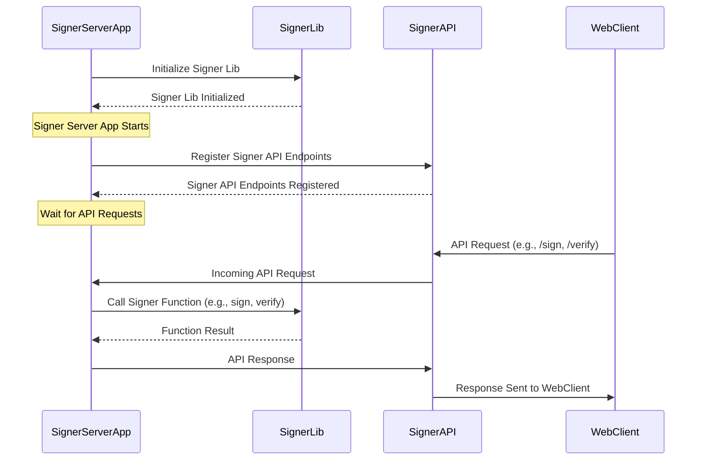

The following sequence diagrams illustrate the communication process between DKG signers (Signer 1, Signer 2, ..., Signer N) and the Smart Contract in the Stacks blockchain. It shows the sequence of events and flow of data between the signers, the smart contract, and the blockchain for key registration, public key retrieval, shared public key computation, message signing, and signature verification. 

This diagram shows the sequence of events that occur when a client activates an autosigner. The AutoSigner API retrieves pending transactions from the blockchain and loops through each transaction. For each transaction, it asks the Signer to determine whether to approve or reject it based on the signer's configuration. If the Signer can determine the decision, it signs the transaction and the AutoSigner API broadcasts it to the blockchain. If the Signer cannot determine the decision, the AutoSigner API notifies the client UI about the decision failure.

The following sequence diagram shows how a signer server app initializes and interacts with a signer lib, and how it registers and responds to requests via a signer API. The server app relies on the signer lib for cryptographic functions like signing and verifying, while the signer API provides a way for external clients such as a Web Client to interact with the signer server app.

