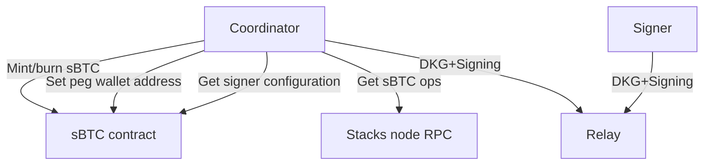
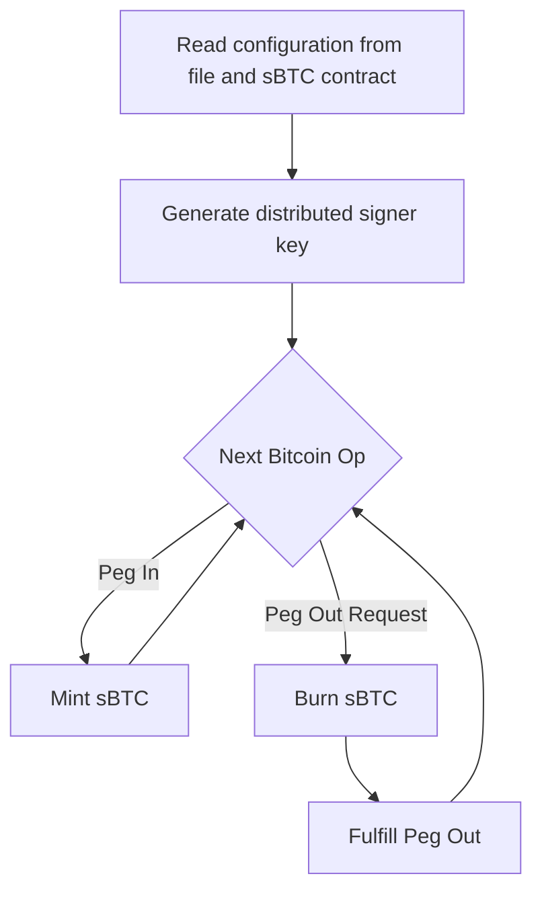

# Coordinator for sBTC private alpha test
The stacks coordinator is a central component of the alpha sBTC testnet. The coordinator is responsible for

- Keeping track of confirmed peg-in & peg-out operations on the Bitcoin chain
- Minting & burning sBTC on the Stacks chain
- Fulfilling peg-out requests

To fulfill the above, the coordinator must:

- Communicate with signers through an http relay to sign peg-out fulfillments and set the peg-wallet address.
- Interact with the alpha sBTC contract to:
  - Set the peg-wallet address.
  - Mint & burn sBTC.
- Poll stacks-node to obtain bitcoin ops.
- Maintain an BTC & STX wallet to cover tx fees.



## Design draft
The coordinator is anticipated to consist of three main components:

1. A job queue which observes the state of the stacks blockchain, and can be polled for peg operations which need to be processed.
2. A fee wallet capable of creating and funding mint/burn sbtc operations on the stacks chain, and peg-out fulfillments on Bitcoin.
3. A frost coordinator, which interacts with an http relay to run frost operations such as distributed key generation and signing messages.

```rust
struct StacksCoordinator {
  job_queue: JobQueue,
  fee_wallet: FeeWallet,
  frost_coordinator: FrostCoordinator,
}

impl JobQueue {
  fn next_unminted_peg_in_op() -> PegInOp
  fn next_unfulfilled_peg_out_request_op() -> PegOutRequest

  // Additional methods to ensure exactly-once processing of requests may be added
}

// Needs to work on mainnet/testnet stacks and mainnet/testnet bitcoin
impl FeeWallet {
  fn mint_sbtc() -> MintSbtcTransaction
  fn burn_sbtc() -> BurnSbtcTransaction
  fn fulfill_peg_out() -> PegOutFulfillTransaction

  fn set_wallet_address()
}

impl FrostCoordinator {
  fn run_dkg_generation()
  fn sign_message(msg: &str) -> Signature
  fn get_aggregate_public_key() -> SignerPublicKey
}
```

## Implementation plan
These should have equivalent issues in the `core-eng` repo.

### #1: Basic structure
Initiate a new project in the `core-eng` repo with the basic structure and components envisioned for the `stacks-coordinator`.
The basic boilerplate should contain:

1. Configuration (Toml)
2. Cli structure (Clap)
3. Mocked types for external interaction points
  - Job Queue
  - Fee wallet
  - Signer coordinator
4. Event loop, incl. tests

Depends on:
- Wire formats

Time estimate: 3 days

### #2: Job queue
Logic for fetching jobs from the stacks-node RPC endpoint

Depends on:
- #1
- RPC endpoints

Time estimate: 3 days

### #3: Signer coordinator
Introduce a component to interact with the signers to run distributed key generation & sign messages.

Depends on:
- #1
- frost-signer, frost-coordinator

Time estimate: 2 days

### #4: Stacks transaction construction
Utilities to generate the necessary transactions to mint & burn sBTC.

Depends on:
- #1
- sBTC contract

Time estimate: 2 days

### #5: BTC transaction construction
Utilities to generate the bitcion transaction for peg-out fulfillments.

Depends on:
- #1

Time estimate: 2 days

## Event loop
This is a rough outline of the coordinator event loop which does not take fault-tolerance into consideration.



## Feature requests
These will be added as standalone issues, not explicitly included in the implementation plan.

### Closed alpha testing
Maintain a closed list of members of the alpha testing. Only addresses in this list is allowed to peg-in & peg-out sBTC.

Time estimate: 1 day.

### One-off commands in CLI
The CLI can start an event loop, but it would also be nice for the coordinator to allow one-off commands such as "process THIS peg-in request" etc.

Time estimate: 1 day.