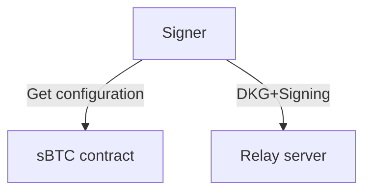
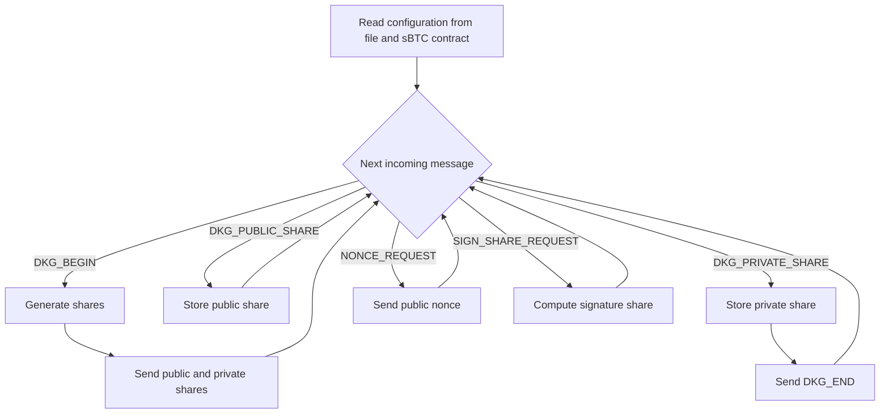
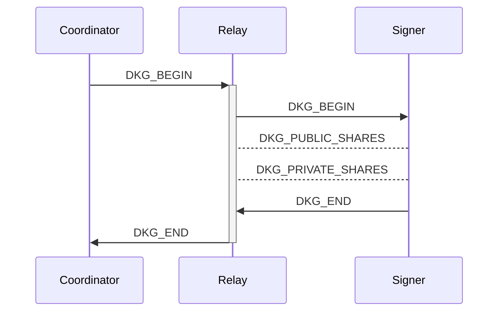
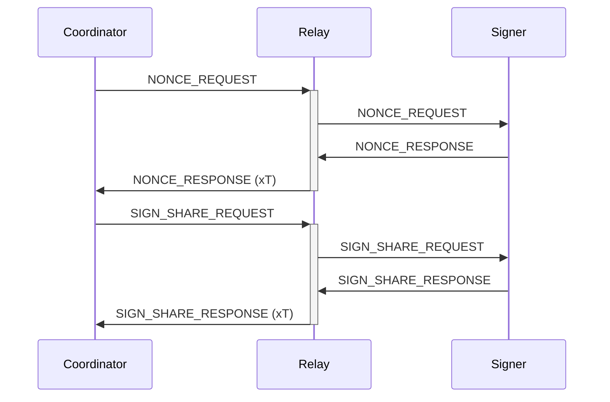
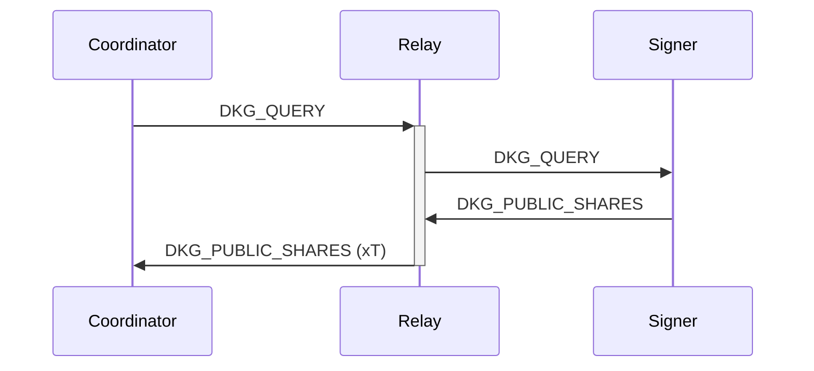

# Stacks signer
The stacks signer is responsible for participating in the FROST signing scheme to
sign sBTC peg out fulfillments from a shared wallet.

Multiple signer instances communicate with each other and a coordinator using an HTTP relay.

The signer interacts with the sBTC contract to read public keys for other signers
and the stacks-coordniator.



## Signer design
The signer system should contain an event loop which communicates with an HTTP relay and
communicates with a signer entity.

```rust
pub trait SignerService {
    type RelayServer;
    type StacksNode; // Shared implementation with stacks-coordinator
    type Signer: Signer;

    fn relay(&self) -> &Self::RelayServer;
    fn stacks_node(&self) -> &Self::StacksNode;
    fn signer(&self) -> &Self::Signer;

    // Provided method
    fn run(mut self);
}

pub trait Signer {
  fn generate_key_shares(&mut self, round_id: u64) -> (PublicShares, PrivateShares);
  fn public_nonce(&self, round_id: u64) -> PublicNonce;
  fn signature_share(&self, round_id: u64, msg: &[u8]) -> SignatureShare;
}  
```

## Signer event loop
A rough outline of the signer event loop



# Relay communication charts
## Distributed key generation


## Sign message


## Query aggregate public key
